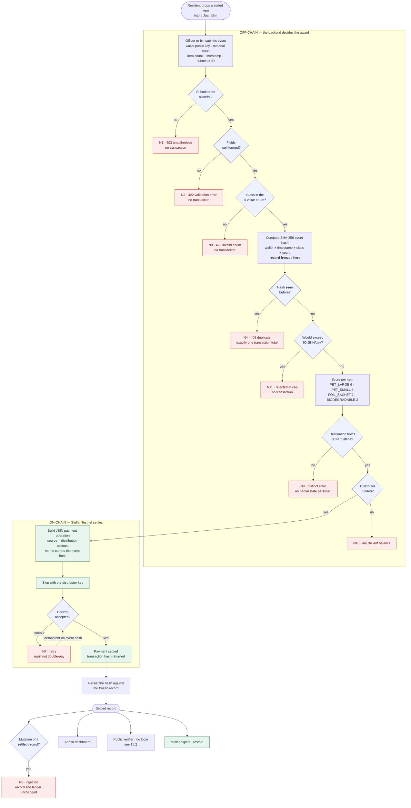
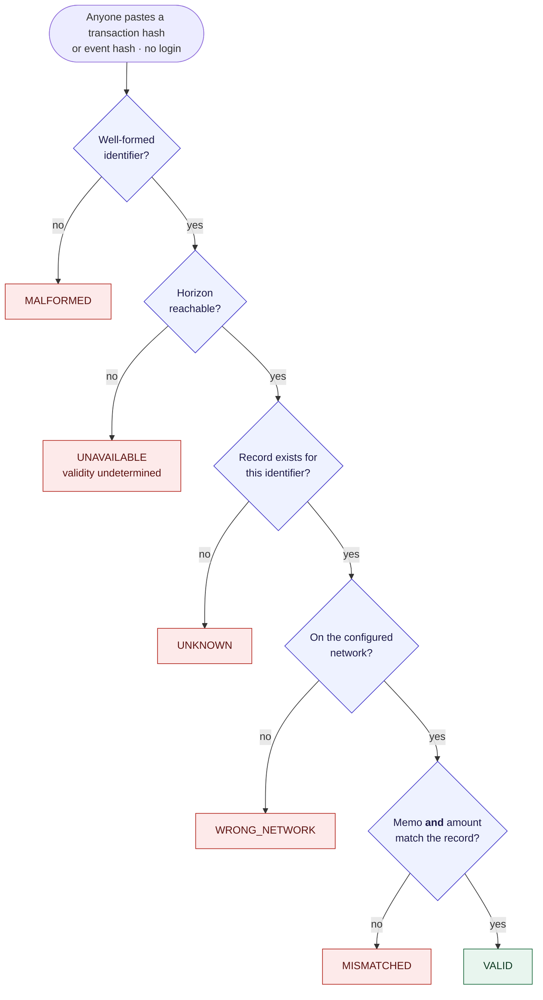
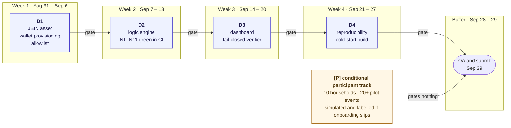

# 15 — System Flow Diagrams

<!-- Provenance: this section is not transcribed from the submission PDF. Every gate, state and label below is taken from the specifications already published in this documentation set - the intake schema and dispatch chain in 03, the rejection cases N1-N11 and verifier states in 11, the on-chain data policy and freeze point in 14, and the week banding in 04. Nothing here introduces new behaviour. -->

These diagrams render natively on GitHub. Each decision node is annotated with the test case that proves it in [11 — Test Plan](11-test-plan.md), so the diagram and the test suite can be checked against each other.

## 15.1 Earn Flow — Submission to Settlement

The architecture is **off-chain logic, on-chain settlement**: the backend decides whether a throw earns anything, and Stellar records the payment. Every rejection path below terminates *before* a transaction is built, which is why the negative-path tests assert on transaction count rather than only on the HTTP response.

Reading it: **nine of the ten decision nodes can only reduce what happens.** There is one path to a payment and nine ways to stop before one exists. The daily cap and the duplicate check both sit upstream of `SCORE`, so a capped or duplicate event never even reaches the point where an amount is calculated.

The freeze point matters for what the hash can be claimed to prove. The record is hashed and frozen *before* dispatch, so the memo on the settled transaction commits to field values that existed prior to payment. That is the whole basis of [14 §14.2](14-data-and-authorization-policy.md#142-what-the-event-hash-proves) — and also its limit: it proves the record is unaltered, not that the material class was judged correctly.

<!-- TODO: resolve the memo encoding before Week 2. Stellar `memo_text` holds 28 bytes, so a 64-character hex SHA-256 digest plus a material class code does not fit. Two workable options: use `memo_hash`, which holds exactly the 32-byte raw digest but leaves no room for the class code, and read the class from the record instead; or use `memo_text` with the class code plus a truncated hash prefix, accepting weaker collision resistance in the memo while the full digest stays in the database. SPRINT.md Week 2 task 7 and docs/03 currently both say "material class + event hash", which is not encodable as written. -->

## 15.2 Verifier State Machine — Fail Closed

The verifier is the artifact that lets a reviewer refute the project rather than trust it. It takes a pasted identifier from anyone, with no login, and resolves to exactly one of six states.

**One path reaches `VALID`; five do not, and there is no sixth path that returns nothing.** That asymmetry is the design requirement. A verifier that returned "valid" — or a blank result a viewer reads as valid — when Horizon was simply unreachable would make every other claim in this repository unfalsifiable. `UNAVAILABLE` therefore renders visually distinct from `VALID`, and N7 in the test plan exists specifically to hold that behaviour in place.

`WRONG_NETWORK` is the state a reviewer hits by pasting a Mainnet hash into a Testnet-configured verifier. That is correct behaviour, not a defect — see [12 §12.3](12-verification-and-reproducibility.md#123-network-configuration).

## 15.3 Deliverable Sequence and the Conditional Track

The sprint's structural answer to the SCF reviewer guidance: the engineering chain and the participant track are separate, and only the engineering chain carries a gate.

The dashed edge is the point. Every solid edge is a gate that can fail the sprint; the dashed edge cannot. If no household consents in time, D1 through D4 still complete and the conditional rows in [05 — Evidence of Completion](05-evidence-of-completion.md) are produced on simulated accounts and labelled as simulated.

## 15.4 What These Diagrams Do Not Show

Stated so the diagrams are not read as claiming more than the system does.

- **No classification step is drawn inside the bin.** The diagram begins after a material class has been asserted by an officer or device. Whether that assertion is correct is outside what any of these flows can establish — [14 §14.2](14-data-and-authorization-policy.md#142-what-the-event-hash-proves).
- **No weight appears anywhere in the earn flow.** Awards are per item. Weight, where recorded, is an optional off-chain field that affects no branch and no amount.
- **No personal data crosses into the on-chain subgraph.** The only fields that reach the ledger are the recipient wallet public key, the material class code, the event hash and the JBIN amount — [14 §14.1](14-data-and-authorization-policy.md#141-on-chain-data-policy).
- **No governance is drawn, because none exists yet.** A single operator holds the issuer, the distributor and the allowlist. There is no multisig node to draw and no revocation path — [14 §14.5](14-data-and-authorization-policy.md#145-governance-limitations--stated-plainly).
